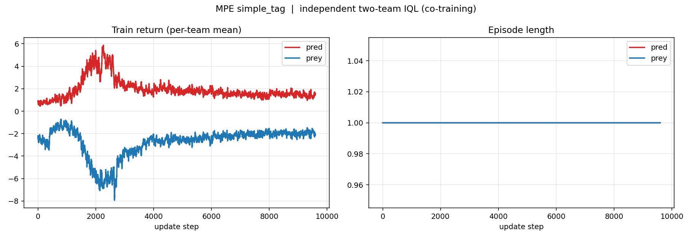
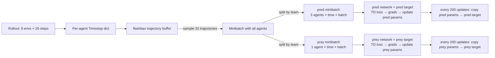

# pp_cotrain — Predator-Prey Co-training Baseline

> An interactive study guide. Read top-to-bottom, check boxes as you go, click the **▸ answer** reveals to self-test.



**What you're looking at:** two independent Q-learners, one per team (3 predators, 1 prey), trained simultaneously on MPE `simple_tag_v3`. The crossing-over of returns around update 2000 is the **co-adaptation signature** we were hoping to see. Everything else in this doc is context for reading that plot.

---

## Table of contents

- [Why this experiment exists](#0--why-this-experiment-exists-the-nature-of-the-thing)
- [Quick start](#1--quick-start-setup-train-visualize)
- [Part 1 — the research problem](#part-1--the-research-problem)
- [Part 2 — the environment (simple_tag)](#part-2--the-environment-mpe-simple_tag_v3)
- [Part 3 — the algorithm (IQL, then two-team fork)](#part-3--the-algorithm)
- [Part 4 — reading the results](#part-4--reading-the-results)
- [Part 5 — debugging war stories](#part-5--debugging-war-stories)
- [Part 6 — positioning for the paper](#part-6--positioning-for-the-paper)
- [Full-syllabus quiz](#full-syllabus-quiz-time-yourself-20-minutes)
- [Glossary](#glossary)
- [Deeper docs](#deeper-docs)
- [Study progress checklist](#study-progress-checklist)

---

## 0 — Why this experiment exists (the nature of the thing)

This is **not** the contribution of the paper. It's the *baseline you have to beat*. Understanding that distinction is the single most important thing in this document.

### What is being tested

Concretely, this experiment asks: **in a small asymmetric adversarial MARL task, can two independent model-free Q-learners reach a stable co-adaptation equilibrium?**

"Stable co-adaptation equilibrium" means:
- Neither team's return diverges to ±∞ (no Bellman blow-up)
- Neither team trivially dominates forever (a.k.a. policy collapse, where one side stops learning)
- Returns eventually plateau instead of cycling (rock-paper-scissors dynamics would show perpetual oscillation)

**Result**: yes — with clear evidence in the return curves, Q-value convergence, and TD loss decay.

### Why we care about the answer

1. **Validates the setup.** Before testing a fancy opponent-modeling + planning method, we need to know the base framework (two agents learning simultaneously in the same env) does not fall over.
2. **Anchors the comparison.** Any gain from the proposed BIRL + MCTS method has to be measured *against* this number. "Our method gets +42 pred return in 200K steps" is meaningless without "this baseline gets +33 pred return in 2M steps".
3. **Establishes the task is solvable at all.** If IQL couldn't make progress, maybe the env itself is pathological (reward too sparse, dynamics too hard) — rule that out first.

### What would falsify the experiment's premise

| symptom | interpretation |
|---|---|
| Returns diverge to infinity | Bellman targets unstable. Fix: lower LR, smaller target step, tighter clip. |
| Returns cycle with no decay in amplitude | Pure rock-paper-scissors dynamics; IQL insufficient. |
| One team's Q collapses to 0 | Policy collapse; exploration probably too cold too fast. |
| TD loss monotonically grows | Target moving faster than learner can track. |

None of these happened in our run. The return curves show a *non-monotone but bounded* trajectory, and TD loss spikes then decays — textbook co-adaptation.

### The conceptual frame: "non-stationary single-agent" vs "multi-agent"

IQL treats each agent as a single-agent RL problem. But from predator's perspective, **prey is part of the environment**, and prey is also learning — so predator's "environment" is non-stationary. Same for prey. This is the central theoretical weakness of independent Q-learning in multi-agent settings, and the reason co-training experiments can fail dramatically. Our experiment is a demonstration that for *this* task with *this* compute, it doesn't fail — but the underlying weakness is real, and it's exactly what the paper's proposed method aims to fix.

<details>
<summary><b>▸ Quick check:</b> In one sentence, why is it misleading to describe this repo as "the method"?</summary>

Because this is the baseline — two independent IQL learners with no opponent modeling, no planning, and no access to the opponent's reward. The method the paper proposes (BIRL opponent-reward model + MCTS planner) is what we intend to *beat* this baseline with.
</details>

<details>
<summary><b>▸ Quick check:</b> Two independent Q-learners are learning in the same env. Whose environment is non-stationary, and why?</summary>

Both agents' environments are non-stationary, because each agent's "environment" includes the other agent, and the other agent is changing its policy. This is the central theoretical weakness of IQL in MARL.
</details>

---

## 1 — Quick start (setup, train, visualize)

- [ ] **Setup (one-time, ~3 min)**

```bash
conda create -n pp_cotrain python=3.11 -y
conda activate pp_cotrain
pip install -e "../JaxMARL[algs]"
pip install "flax==0.10.2"    # JaxMARL pins jax<=0.4.38 but not flax; newer flax breaks
```

- [ ] **Train (2M steps, ~150s on M4 Pro CPU)**

```bash
python src/iql_teams.py                       # default: 2M steps, 1 seed
python src/iql_teams.py NUM_SEEDS=3            # vmap 3 seeds in parallel
python src/iql_teams.py alg.TOTAL_TIMESTEPS=500000   # quicker
```

- [ ] **Plot training curves**

```bash
python src/plot_metrics.py logs/MPE_simple_tag_v3/iql_teams_MPE_simple_tag_v3_seed0_metrics.npz
# writes plots/train_curves.png and plots/loss_q.png
```

- [ ] **Visualize a greedy episode**

```bash
python src/visualize_rollout.py \
  --pred_params logs/MPE_simple_tag_v3/iql_teams_MPE_simple_tag_v3_pred_seed0_vmap0.safetensors \
  --prey_params logs/MPE_simple_tag_v3/iql_teams_MPE_simple_tag_v3_prey_seed0_vmap0.safetensors \
  --seed 7 --steps 60 --out plots/rollout.gif
```

---

## Part 1 — The research problem

### The overall motivation (2-min version)

Adversarial multi-agent RL is everywhere — sports, security, competitive games, multi-robot conflict. The two dominant playbooks both have known failure modes:

1. **Model-free league training** (AlphaStar-style). Keep a population of past policies; each new policy trains against a mix. Works, but brute-force expensive, loses plasticity, and learned policies aren't interpretable or transferable.
2. **Model-based self-play** (AlphaZero / MuZero). Requires the game to be *zero-sum, symmetric, with known rules*. Go, Chess, Shogi. Breaks for **asymmetric** games — where team A's optimal strategy is not a mirror of team B's — because you can't just play yourself.

Neither is a great fit for the regime we care about: asymmetric tasks with partial observability, where *the opponent is also learning*, so behavior cloning them is chasing a moving target.

### The paper's proposed key insight

> Each team learns a model of the opposing team's **reward function** (not actions, not policy), and feeds that model to an MCTS-based planner.

**Why reward and not policy?** A policy is a very high-dimensional object that changes rapidly during training. A reward function is a much more compact and **slower-moving** latent variable — it's what the opponent is *trying to do*, which tends to be stable across changes in *how* they try.

**How to infer opponent reward?** Bayesian Inverse RL (BIRL): assume the opponent preferred their observed trajectory to alternatives in the MCTS tree, and do Bayesian updates over a hypothesis space of reward functions.

### Where this baseline fits

This repository is the **model-free, no-opponent-modeling, no-planning** baseline that the proposed method should beat. It is deliberately minimal:

- No opponent modeling
- No planning (pure reactive policies)
- No centralized critic
- Only ε-greedy exploration

If the proposed method beats this on *sample efficiency*, *robustness to env changes*, and *final performance*, we have a paper.

<details>
<summary><b>▸ Quiz (easy):</b> Why doesn't AlphaZero-style self-play apply to our predator-prey setup?</summary>

Two reasons: (1) the task is **asymmetric** — predators and prey have different speeds, different reward structures, different obs dims — so there's no meaningful "play against a copy of yourself"; (2) the game rules include continuous-state physics, not a discrete turn-based structure AlphaZero's MCTS is designed for.
</details>

<details>
<summary><b>▸ Quiz (medium):</b> Behavior cloning the opponent seems simpler than BIRL. Why does the paper argue against BC?</summary>

BC fits a classifier to `opponent_action | state`. If the opponent is still learning, the BC target is a moving distribution — by the time your BC model converges, the opponent is already playing something else. Reward is more stable than policy, so inferring reward gives you a less-moving target.
</details>

<details>
<summary><b>▸ Quiz (hard):</b> What if the opponent's reward function is *also* changing (e.g. a curriculum)? Does the paper's argument hold?</summary>

Weaker, but still holds for the common case. Even in a curriculum, the opponent's long-run objective (capture the flag, reach the goal) is typically fixed; only intermediate shaping terms change. Policies can change frame-to-frame; true rewards usually change far more slowly. The argument breaks only if the opponent's *goal* genuinely shifts — in which case all opponent-model-based methods struggle equally.
</details>

---

## Part 2 — The environment (MPE `simple_tag_v3`)

### What's in the arena

```
   ┌─────────────────── arena (2×2, centered at origin) ──┐
   │                                                      │
   │       ●              ◆ ◆                             │
   │   adversary_0      landmarks (obstacles)             │
   │                                                      │
   │                                                      │
   │       ●                        ○                     │
   │   adversary_1                agent_0 (prey)          │
   │                                                      │
   │       ●                                              │
   │   adversary_2                                        │
   └──────────────────────────────────────────────────────┘
```

Predators (red ●): radius 0.075, max speed **1.0**, accel 3.0.
Prey (green ○): radius 0.05, max speed **1.3**, accel 4.0.
Landmarks (black ◆): radius 0.2, static, block movement.

### Actions & observations

- **Actions**: every agent picks one of `Discrete(5)` = {no-op, N, S, E, W}
- **Predator obs (16 dims)**: own velocity (2), own position (2), landmark-relative positions (4), other-agent-relative positions (6), prey velocity (2)
- **Prey obs (14 dims)**: same without predator velocities
- **After `CTRolloutManager` preprocessing**: padded to 16 + 4-dim agent-ID one-hot = **20-dim** uniform obs for every network forward

### Rewards

```python
# from JaxMARL/jaxmarl/environments/mpe/simple_tag.py:157-172
def rewards(self, state):
    # per-predator: +10 for each collision with prey
    ad_rew = 10 * jnp.sum(collisions_adv_with_prey)

    # prey: -10 per collision, smooth boundary penalty if out of bounds
    rew = -10 * jnp.sum(collisions)
    rew -= map_bounds_reward(abs(state.p_pos[prey_idx]))

    return {'adversary_i': ad_rew, 'agent_0': rew}
```

**Key arithmetic to memorize:**

| event | predator team total | prey |
|---|---|---|
| one capture | **+30** (each of 3 predators gets +10) | −10 |
| prey hits boundary | 0 | −(small, smooth) |
| nothing happens | 0 | 0 |

### The asymmetries baked in

| dimension | predator | prey | notes |
|---|---|---|---|
| max speed | 1.0 | 1.3 | prey is 30% faster → predators must coordinate |
| # agents | 3 | 1 | outnumbered prey |
| obs dim | 16 | 14 | prey has strictly less info |
| reward per capture | +10 (each) | −10 | team-wise +30 vs −10 |
| boundary penalty | no | yes | only prey can leave |

<details>
<summary><b>▸ Quiz (easy):</b> If one capture occurs, what's the total reward the predator TEAM sees?</summary>

**+30.** Each of the 3 predators independently gets +10 (reward is replicated across predators, not shared). `simple_tag.py:165-166`: `rew = {a: ad_rew for a in self.adversaries}`.
</details>

<details>
<summary><b>▸ Quiz (medium):</b> Why are predator obs 16-dim but prey obs 14-dim?</summary>

Predator obs includes the prey's velocity (+2 dims); prey obs does not include predator velocities. This is a PettingZoo convention inherited from the original MPE, encoding an asymmetry: predators can observe what the prey is doing, prey can only observe where the predators *are* (not their velocities).
</details>

<details>
<summary><b>▸ Quiz (hard):</b> A naive unified IQL sees all 4 agents' obs as 20-dim after padding + one-hot. But internally, the prey has 2 "zero" dimensions from padding. Does this matter for learning?</summary>

Not for correctness — a standard feedforward/GRU network can learn to ignore constant zeros. It does waste ~10% of the input layer's capacity per prey forward. In practice for this task it's negligible; in SMAC with many more agents and larger obs gaps, you'd want to use per-team networks with per-team obs sizes.
</details>

---

## Part 3 — The algorithm

### Stock JaxMARL IQL (the wrong thing)

```python
# JaxMARL/baselines/QLearning/iql_rnn.py, simplified
network = RNNQNetwork(action_dim=..., hidden_dim=64)
train_state = CustomTrainState.create(network, params=network.init(...), ...)

# at action-select time:
_, q_vals = jax.vmap(network.apply, in_axes=(None, 0, 0, 0))(
    train_state.params,   # <- in_axes=None = SAME params for every agent
    hs, obs, dones,
)
```

The `None` in `in_axes` means every agent's forward pass uses the **same** parameters. For cooperative MARL, fine. For adversarial MARL, a disaster: predator gradients want to *maximize* `Q(state, chase_prey)`, prey gradients want to *minimize* `Q(state, being_chased)` — applied to the same weights.

### Our fork: two independent learners

```python
# src/iql_teams.py, simplified
teams = {'pred': ['adversary_0', 'adversary_1', 'adversary_2'],
         'prey': ['agent_0']}

networks    = {t: RNNQNetwork(...) for t in teams}
train_states = {t: CustomTrainState.create(networks[t], ...) for t in teams}

# at action-select time, for each team independently:
for t in teams:
    _, q = jax.vmap(networks[t].apply, in_axes=(None, 0, 0, 0))(
        train_states[t].params,    # ← per-team params, shared within team
        hs[t], team_obs, team_dones,
    )
```

### Data flow diagram



### What's duplicated vs shared

| component | per-team? | why |
|---|---|---|
| `RNNQNetwork` | yes — 2 instances | different value functions |
| `CustomTrainState` (params, optimizer, target) | yes | different params |
| flashbax buffer | **no** — 1 shared | buffer just stores dicts; cheap |
| ε-greedy schedule | no | both teams use same ε(t) |
| rollout env | no | agents step the env together |

### Why share params *within* a team?

The 3 predators are role-symmetric: same action space, same reward structure, same observation pattern (modulo who is "self" vs "other"). Parameter sharing with a concatenated agent-ID one-hot gives you **3× sample efficiency** inside the team. Think of it as "one predator policy executed from 3 vantage points" — like how CNNs share weights across spatial locations.

### Why NOT share params across teams?

Opposite reward signals. Shared weights would get gradients pulling both ways on the same parameter — the pathology described in the stock-IQL section above.

<details>
<summary><b>▸ Quiz (easy):</b> How many Q-networks does <code>iql_teams.py</code> train, and how are they assigned to the 4 agents?</summary>

**Two.** One shared across all 3 predators (`adversary_0/1/2`), one for the lone prey (`agent_0`).
</details>

<details>
<summary><b>▸ Quiz (medium):</b> At learn time we sample ONE minibatch from the shared buffer. Walk through what happens next.</summary>

1. Split the minibatch by agent name into per-team tensors (pred team: 3 agents × time × batch × 20-dim obs; prey team: 1 × time × batch × 20).
2. Forward each team's network (online + target) through its slice.
3. Compute team-local TD target: `r_team + γ(1−d) Q_target_team(next_state, argmax_a Q_team(next_state, a))` — double-Q style.
4. MSE loss, `value_and_grad`, `apply_gradients` — for each team independently.
5. Every 200 updates, hard-copy online → target per team.
</details>

<details>
<summary><b>▸ Quiz (hard):</b> Why double-Q (argmax from online, value from target) instead of pure target-network Q?</summary>

Double-Q reduces the maximization bias of pure target-network bootstrapping. If the target network has any noise in its Q estimates, `max_a Q_target(s, a)` systematically overestimates the true max. Using online's argmax + target's value breaks that correlation. This is the van Hasselt 2015 fix; JaxMARL's stock IQL uses it, and we inherited it. See <code>src/iql_teams.py:277-284</code>.
</details>

<details>
<summary><b>▸ Quiz (hard):</b> The ε-greedy schedule is shared across teams. Would per-team schedules make sense?</summary>

Potentially yes. A stronger team might want to exploit earlier (faster ε decay) while a weaker team needs more exploration. In our run both teams learn at similar rates, so it didn't matter — but in asymmetric tasks where one team has an inherent advantage, per-team schedules are a natural ablation.
</details>

---

## Part 4 — Reading the results

### The three plots to know

**1. Training returns (`plots/train_curves.png`)** — the headline artifact.

Three phases visible:
- **Phase 1 (0 → ~2000 updates): predators learn to chase.** Pred return climbs to ~+5, prey troughs at ~−8. Prey is getting caught *and* bouncing off walls.
- **Phase 2 (~2000 → ~4000 updates): prey catches up.** Pred return drops to ~+1.5, prey recovers to ~−2. This is the co-adaptation kick.
- **Phase 3 (~4000 → end): noisy equilibrium.** Both teams oscillate around the ±2 band. Neither dominates.

The *non-monotonicity* of the pred return curve is the thing to highlight — it's the visible signature of the prey's learning feeding back.

**2. Loss & Q-values (`plots/loss_q.png`)**

- **TD loss**: both teams spike to ~10 around update 2000 (the policy-churn phase) then decline monotonically to ~4. No divergence.
- **Q-values**: converge symmetrically to **+5 for pred, −5 for prey**. With γ=0.9 and ~1 capture per 25-step episode, an expected +30 team reward at some future step `n` is worth `30 × 0.9^n ≈ 5` for `n ≈ 17`. The number is approximately right.

**3. Greedy rollout (`plots/rollout.gif`)** — 60 steps, seed 7, **5 capture events**, roughly one every 12 steps. Watch the two trailing predators angle to cut off escape routes while the third chases head-on — **emergent pincer-like behavior** from nothing but shared parameters and competitive reward.

### Key numbers table (memorize)

| metric | value |
|---|---|
| wall-clock (M4 Pro CPU, 1 seed) | **150 seconds** |
| throughput | ~13 300 env-steps / s |
| total env steps | 2 000 000 |
| update steps | 9 615 |
| pred test return (final) | **+33.125** / 30-step ep |
| prey test return (final) | **−49.05** / 30-step ep |
| pred test return (initial) | +14.375 |
| prey test return (initial) | **−247.46** |
| pred return peak (train) | ~+5 around update 2000 |
| pred return plateau (train) | ~+1.5 |
| Q converged (pred / prey) | **+5 / −5** |
| captures in 60-step greedy rollout | **5** (seed 7) |

### Interpreting "prey went from −247 to −49"

That's a ~80% reduction in prey's "damage taken". But most of it is **not** "prey stopped getting caught" — captures scale with pred return, and pred only gained ~19 points (14 → 33). Most of the prey's improvement is **learning to stop bumping into the walls**: reducing `map_bounds_reward` penalties. This is useful to say explicitly during Q&A.

<details>
<summary><b>▸ Quiz (easy):</b> What's the predator team's final greedy-eval return per 30-step episode?</summary>

**+33.125.** That's roughly 1.1 capture events per episode (since each capture = +30 team reward).
</details>

<details>
<summary><b>▸ Quiz (medium):</b> Why does the predator return *drop* after peaking around update 2000?</summary>

Prey is also learning, and by update 2000 it's seen enough captures to start getting a sharp learning signal. As prey learns to evade, predator captures drop, so predator return drops. The plateau around +1.5 is the co-adaptation equilibrium — not a bug.
</details>

<details>
<summary><b>▸ Quiz (medium):</b> If you saw predator return monotonically climb to +5 and stay there, what would you suspect?</summary>

Prey isn't learning. Possible causes: prey's gradients are zero (reward too sparse, or rewards not flowing through the minibatch split correctly), prey's learning rate is too low, prey's replay buffer is empty (bug in team split), or prey's eps schedule kept it at pure random. The visible drop from +5 → +1.5 is evidence that prey is in fact learning.
</details>

<details>
<summary><b>▸ Quiz (hard):</b> Converged Q-values are +5 pred / −5 prey. Derive approximately why.</summary>

`Q ≈ E[Σ γ^t r_t]`. For pred, the on-policy expected reward per 25-step episode is +33, achieved roughly once per episode. So `Q(state_0) ≈ 33 × γ^n` where `n` is expected steps to the reward. For Q = 5, `n = log(5/33) / log(0.9) ≈ 18` steps — half the episode, reasonable. Prey symmetric with minus sign.
</details>

<details>
<summary><b>▸ Quiz (hard):</b> What would you log to diagnose a "returns diverge" failure mode?</summary>

(a) TD loss per team — if it grows unboundedly, target is running away from online. (b) Q-value distribution extremes — not just mean. (c) Gradient norms per team — if clipping is always active, your effective LR is too high. (d) Target-update interval — too frequent = chasing own tail. (e) Buffer age — too small a buffer means high correlation between recent samples.
</details>

---

## Part 5 — Debugging war stories

### War story #1: flax / jax version trap

**Symptom:** First run, `AttributeError: module 'jax.api_util' has no attribute 'debug_info'`.

**Root cause:** JaxMARL's `pyproject.toml` pins `jax<=0.4.38` but leaves `flax` unpinned. `pip` resolved to flax 0.10.4, which imports `jax.api_util.debug_info` — an API introduced in jax 0.5.x. So flax 0.10.4 is incompatible with any jax ≤ 0.4.38.

**Fix:** `pip install "flax==0.10.2"`.

**Lesson:** Underspecified pins bite. When a repo pins only one side of an API contract, always check the other side's release notes.

### War story #2: the int32 / float32 reward dtype bug

**Symptom:** After `LEARNING_STARTS=10000` timesteps, training hard-crashes with `chex.AssertionError: [Chex] Assertion assert_trees_all_equal_dtypes failed: types: float32 != int32`.

**Root cause:** `simple_tag.py:163` computes predator reward as `10 * jnp.sum(collisions)`. `10` is a Python int; `jnp.sum(bool_array)` is int32. So **adversary rewards are int32**.

Prey reward: `-10 * jnp.sum(collisions) - map_bounds_reward(...)` — int plus float32 → float32. So **prey reward is float32**.

The flashbax buffer was initialized from a random-policy sample trajectory, which did NOT apply `REW_SCALE`. So stored dtype was `{adversary_0: int32, agent_0: float32}`.

The real rollout path multiplied by `REW_SCALE=1.0` (a float). `1.0 × int32_array → float32_array`. So first real `buffer.add` after learning starts tries to insert `{adversary_0: float32, ...}` into a buffer expecting `{adversary_0: int32, ...}`. Chex catches it.

**Fix:** cast rewards to `float32` explicitly in both paths. `src/iql_teams.py:201, 269-272`.

**Why the stock JaxMARL `iql_rnn.py` didn't hit this:** its default config has NO `REW_SCALE`, so the scale is a Python int `1`, and `1 × int32_array → int32_array`. Dtype matches by coincidence.

**Lesson:** Python's int-vs-float promotion rules combined with implicit buffer dtype inference = subtle, rollout-phase-dependent bugs. Always cast explicitly at dtype boundaries.

### War story #3: rollout showed 0 captures on seed 0

**Symptom:** Trained model, `visualize_rollout.py --seed 0` prints "Avg predator reward per step: 0.0" — but test return said +33!

**Root cause:** Single short rollout (75 steps) with a single random seed that happened to spawn prey in a corner away from predators. Not a bug.

**Fix:** Run multiple seeds, pick a good one (seed 7 gave 5 captures in 60 steps).

**Lesson:** Stochastic initial state + short horizon = high variance. A single-rollout "demo" is not evidence of model quality — the *eval metric across 128 envs* is. Use rollouts for *narrative*, not *measurement*.

<details>
<summary><b>▸ Quiz (easy):</b> Why did downgrading flax from 0.10.4 to 0.10.2 fix the crash?</summary>

flax 0.10.4 imports `jax.api_util.debug_info`, which doesn't exist in jax 0.4.38 (the version JaxMARL pins). 0.10.2 is the last flax version that doesn't use that API.
</details>

<details>
<summary><b>▸ Quiz (medium):</b> Explain why <code>REW_SCALE=1.0</code> (float) triggers a bug but <code>REW_SCALE=1</code> (int) would not.</summary>

`1.0 × int32_array` promotes to float32. `1 × int32_array` stays int32. The flashbax buffer was initialized with int32 adversary rewards (from a no-REW_SCALE sample trajectory); once the real rollout promoted to float32, buffer.add saw a dtype mismatch and crashed.
</details>

<details>
<summary><b>▸ Quiz (hard):</b> Does the int32/float32 bug silently degrade training, or hard-fail?</summary>

**Hard-fail.** `chex.assert_trees_all_equal_dtypes` raises AssertionError immediately on the first bad add — no silent corruption. This is the right behavior for dtype mismatches; silent promotion inside a JIT-compiled scan would be much worse to debug.
</details>

---

## Part 6 — Positioning for the paper

### What this baseline establishes

1. **The task is tractable.** Two independent Q-learners can reach a co-adaptation equilibrium in 2M steps.
2. **The baseline number.** Predator test return +33.125, prey test return −49.05 after 2M steps.
3. **The training dynamics.** Co-adaptation signature is visible (pred peaks then settles as prey catches up).

### What this baseline does NOT address

- **Opponent modeling.** Neither team has any explicit representation of the other team's objective.
- **Planning.** Both teams are pure reactive Q-learners; no lookahead.
- **Sample efficiency.** 2M env steps is a lot for a 2D task this small.
- **Transfer / robustness.** If we change the map (move obstacles, resize the arena), the policy fails — no explicit env model.
- **Non-stationarity handling.** IQL structurally assumes a stationary world; it ignores that the opponent is learning.

### Where the proposed method should beat it

| axis | expected gain | how |
|---|---|---|
| sample efficiency | 5–10× | planner uses opponent-reward model + env model to simulate rollouts without spending env samples |
| transfer | infinite | planner's env model is unchanged when the arena changes; IQL retrains from scratch |
| non-stationarity | qualitative | BIRL explicitly models opponent reward as a distribution that updates as opponent changes |
| interpretability | qualitative | inspect the inferred opponent reward; IQL's policy is a black-box GRU |

### Concrete next steps

1. **BIRL reward estimator.** Start with a small MLP mapping state features → scalar reward; train with a Boltzmann-rational likelihood: `P(trajectory | reward) ∝ exp(Σ β × Q_reward(state, action))`. Use observed opponent trajectories as "trajectory" input.
2. **MCTS planner.** 3 predators × 5 actions = 125 joint-action branching factor, borderline. Use progressive widening (add one action per node per visit) or a factored dec-MCTS approach (IJCAI 2020) to keep tree size manageable.
3. **Leaf value estimator.** Use the IQL Q-network from this repo as the leaf-node value function in MCTS — gives you model-free bootstrapping inside the planner.
4. **Ablations.** Turn off BIRL → pure MCTS with a uniform opponent prior. Turn off MCTS → pure IQL (this repo). Turn off leaf bootstrapping → pure Monte Carlo rollouts.

<details>
<summary><b>▸ Quiz (easy):</b> In one sentence, what does this baseline NOT claim?</summary>

Sample efficiency, opponent modeling, transfer, robustness to env changes, or centralized-critic benefits — all of which are target improvements for the paper's proposed method.
</details>

<details>
<summary><b>▸ Quiz (medium):</b> PI asks "why not train MAPPO as the baseline instead?" Give a principled answer.</summary>

MAPPO is a policy-gradient method with a centralized critic. Swapping it in would confound the comparison: any gain from the proposed method couldn't be cleanly attributed to opponent-reward modeling (the paper's contribution) vs to "better credit assignment via centralized critic". IQL isolates the variable — any improvement is attributable to opponent modeling, full stop. If the PI wants a centralized baseline too, we can add it as a second baseline.
</details>

<details>
<summary><b>▸ Quiz (hard):</b> Sketch how you'd run the "transfer" ablation — how does the IQL baseline perform when the arena changes at test time?</summary>

(1) Train IQL with 2 landmarks at fixed positions. (2) At test, move landmarks to new random positions. (3) Measure predator capture rate with no further training. Expectation: capture rate drops sharply because policies have memorized obstacle layouts. Compare to proposed method: after training, swap landmark positions, run MCTS with the same env-physics model — expect modest drop because the planner has an explicit obstacle model and can replan.
</details>

---

## Full-syllabus quiz (time yourself: 20 minutes)

### Section A — research framing
- **A1.** Why does AlphaZero-style self-play fail for asymmetric predator-prey?
- **A2.** What is the paper's key insight about *what* to model about the opponent?
- **A3.** Why is modeling opponent *reward* better than modeling opponent *policy*?

### Section B — environment
- **B1.** How many predators, prey, landmarks in `MPE_simple_tag_v3`?
- **B2.** Max speed ratio prey:predator?
- **B3.** Total predator team reward per capture event?
- **B4.** Why do predator obs have 2 more dims than prey obs?

### Section C — algorithm
- **C1.** How many Q-networks does stock JaxMARL `iql_rnn.py` create for a 4-agent task?
- **C2.** Why does shared-params-across-teams fail in adversarial MARL?
- **C3.** In `iql_teams.py`, is the flashbax buffer duplicated per team? Why or why not?
- **C4.** Why share params within the predator team?
- **C5.** What does `TAU=1.0` mean for target-network updates?
- **C6.** Describe what double-Q-learning does in one sentence.

### Section D — hyperparameters
- **D1.** Given `TOTAL_TIMESTEPS=2e6`, `NUM_STEPS=26`, `NUM_ENVS=8`, how many update steps?
- **D2.** What's the rationale for `GAMMA=0.9` in a 25-step episode env?
- **D3.** What fraction of training has ε > 0.1?

### Section E — results
- **E1.** Wall-clock on M4 Pro CPU for 2M steps?
- **E2.** Final pred / prey test returns?
- **E3.** Where does pred return peak and what value?
- **E4.** Converged Q values for each team?
- **E5.** How many captures in the seed-7 60-step rollout?
- **E6.** Why does prey's test return improve so much more than pred's?

### Section F — debugging
- **F1.** Why `flax==0.10.2` specifically?
- **F2.** Explain the int32/float32 reward dtype bug in 2 sentences.
- **F3.** Why does this bug hard-fail rather than silently degrade training?

### Section G — positioning
- **G1.** Name three axes the paper's proposed method should beat this baseline on.
- **G2.** What's the next concrete deliverable after this baseline?
- **G3.** One-sentence pitch of the project you could give in an elevator?

<details>
<summary><b>▸ Full-syllabus quiz answers</b></summary>

**A1.** Asymmetric task (different speeds, rewards, obs) + continuous state + simultaneous-move dynamics — none of which fit AlphaZero's symmetric turn-based assumption.
**A2.** The opponent's **reward function**, not their policy or actions.
**A3.** Rewards are more compact and slower-moving than policies. When opponent is still learning, their policy is a moving target; their reward is (approximately) invariant.

**B1.** 3 predators, 1 prey, 2 landmarks.
**B2.** 1.3 : 1.0 = prey is **30% faster**.
**B3.** **+30** total (each predator gets +10 independently).
**B4.** Predator obs includes prey velocity (+2 dims); prey obs does not include predator velocities — baked-in information asymmetry.

**C1.** **One.** Shared across all 4 agents via `vmap(..., in_axes=(None, 0, 0, 0))`.
**C2.** Predator gradients (maximize `Q(chase)`) and prey gradients (minimize `Q(being_chased)`) conflict on the same parameters.
**C3.** **Not duplicated** — one shared buffer. Buffer just holds per-agent dicts; teams split the minibatch at learn time. Simpler, cheaper.
**C4.** The 3 predators are role-symmetric → 3× sample efficiency from sharing, plus the agent-ID one-hot lets the shared network still output different actions per predator.
**C5.** **Hard** target update: copy online params → target params directly. `TAU=0.005` would be Polyak (soft) averaging.
**C6.** Use online's argmax but target's Q-value to break the correlation that causes Q-overestimation.

**D1.** `2e6 / 26 / 8 = 9615` update steps.
**D2.** Episodes are 25 steps; `γ^25 ≈ 0.07` already heavily discounts post-episode rewards. γ=0.99 would over-weight phantom future rewards that never happen.
**D3.** **~10%** — ε decays from 1.0 to 0.05 over `0.1 × 9615 ≈ 962` updates, then stays at 0.05.

**E1.** **150 seconds**.
**E2.** **+33.125 / −49.05** per 30-step episode.
**E3.** Peaks around update **2000** at value **~+5**; settles around **~+1.5** by end.
**E4.** **+5 pred, −5 prey** — symmetric.
**E5.** **5 captures** in 60 steps (≈ 1 every 12 steps).
**E6.** Prey's gain is mostly from learning to stop hitting walls (`map_bounds_reward`), not from avoiding more captures. Captures only dropped slightly; boundary penalties dropped a lot.

**F1.** flax 0.10.4 uses `jax.api_util.debug_info`, which doesn't exist in JaxMARL's pinned jax ≤ 0.4.38. 0.10.2 is the last compatible.
**F2.** `simple_tag.py` computes predator reward as int32 (`10 * int_sum`), prey reward as float32 (int − float). `REW_SCALE=1.0` promotes predator rewards to float32 at rollout time, but the buffer was initialized with int32 from a no-REW_SCALE sample trajectory → dtype mismatch on first real `buffer.add`.
**F3.** `chex.assert_trees_all_equal_dtypes` explicitly raises on mismatch — this is by design, to prevent silent type-promotion bugs inside JIT-compiled scans.

**G1.** Sample efficiency, transfer/robustness to env changes, non-stationarity handling (and a bonus: interpretability).
**G2.** Two parallel tracks: (a) BIRL-based opponent-reward estimator; (b) MCTS planner using that estimator + this IQL's Q as leaf value.
**G3.** "We're building model-based co-training for asymmetric adversarial MARL — each team learns a model of the opponent's reward via Bayesian inverse RL, then plans with MCTS. This baseline is the model-free version the method needs to beat."
</details>

---

## Glossary

<details>
<summary><b>Click to expand MARL / RL glossary</b></summary>

- **BIRL** — Bayesian Inverse RL. Posterior distribution over reward-function hypotheses given observed trajectories, assuming the actor is (approximately) optimal under the true reward.
- **Bellman target** — the right-hand side of the Bellman equation: `r + γ · max_a' Q(s', a')`. The thing Q-learning regresses towards.
- **Bootstrap (in RL)** — estimate a value using another value estimate (as in TD: use `Q(s')` to bootstrap the target for `Q(s)`).
- **Co-training (in MARL)** — both teams' policies update simultaneously; each team's environment is non-stationary because of the other.
- **CTDE** — Centralized Training, Decentralized Execution. Global info at train time, local at test.
- **dec-MCTS** — decentralized MCTS: one tree per agent, coordinated via communication / learned teammate models.
- **Double-Q learning** — use online network for argmax, target network for value, to reduce max-bias.
- **ε-greedy** — with prob ε take a random action, else take argmax_a Q. Standard discrete exploration.
- **flashbax** — JAX-native replay buffer library, JIT-compatible.
- **GRU** — Gated Recurrent Unit, a simple RNN cell. Used here for the recurrent Q-network.
- **IGM** — Individual-Global-Max: argmax of team Q = joint argmax of individual Qs. VDN/QMIX require it; doesn't hold across adversarial teams.
- **IQL** — Independent Q-Learning: each agent has its own Q, trained with its own reward. No shared critic.
- **JaxMARL** — JAX-based MARL library (Flair/Oxford). This repo depends on it.
- **League training** — maintain a population of past policies; train against a mix. AlphaStar's approach.
- **MAPPO** — Multi-Agent PPO: policy-gradient with a centralized critic.
- **MCTS** — Monte-Carlo Tree Search. Build a tree of futures; evaluate via rollouts or bootstrap.
- **MPE** — Multi-agent Particle Environment. A suite of simple 2D tasks (`simple_spread`, `simple_tag`, etc.).
- **Non-stationarity (in MARL)** — the effective environment each agent sees is non-stationary because other agents are learning.
- **Off-policy** — learn about the greedy policy while acting ε-greedily. Q-learning is off-policy; that's why replay works.
- **PettingZoo** — Python MARL API standard; JaxMARL envs follow its conventions.
- **Polyak averaging** — slow exponential moving average of target params towards online (τ ≪ 1).
- **QMIX** — team Q = monotonic mixer(agent Qs, global state). Cooperative.
- **Replay buffer** — store past transitions, sample for learning. Breaks temporal correlation.
- **Self-play** — train against a copy of yourself. Requires symmetric zero-sum games.
- **simple_tag** — MPE task: 3 predators chase 1 prey.
- **TD error** — `target − Q(s, a)`, where target = `r + γ · V(s')`.
- **VDN** — Value Decomposition Network. Team Q = sum of agent Qs. Cooperative.
- **vmap** — JAX's vectorizing map. `jax.vmap(f)` applies `f` to a batched input in parallel.
</details>

---

## Deeper docs

- [`docs/01_guide.md`](docs/01_guide.md) — technical architecture walkthrough (1300 words)
- [`docs/02_presentation.md`](docs/02_presentation.md) — 10-minute demo script with timings and phrasing
- [`docs/03_qa.md`](docs/03_qa.md) — 17 anticipated Q&A
- [`docs/04_quiz.md`](docs/04_quiz.md) — printable 7-section self-check quiz with answers
- [`docs/05_cheatsheet.md`](docs/05_cheatsheet.md) — numbers table, glossary, pitch, code refs

---

## Study progress checklist

Check each box when you're confident you could explain the topic to someone else.

### Foundations
- [ ] I can explain *why* this is a baseline, not a method contribution
- [ ] I can explain why self-play and behavior-cloning both fail for asymmetric learning opponents
- [ ] I can state the paper's proposed key insight in one sentence

### Environment
- [ ] I know the arena size, number of agents per team, and max speeds
- [ ] I can recite the reward rule for one capture event
- [ ] I can list 3 asymmetries baked into the task

### Algorithm
- [ ] I can explain why stock JaxMARL IQL is wrong for adversarial tasks
- [ ] I can sketch the data flow through `iql_teams.py` (rollout → buffer → per-team loss)
- [ ] I can justify "share params within team, not across teams"
- [ ] I understand double-Q learning and target-network updates

### Hyperparameters
- [ ] I can derive NUM_UPDATES from TOTAL_TIMESTEPS, NUM_STEPS, NUM_ENVS
- [ ] I can justify GAMMA=0.9 given the episode length
- [ ] I understand what LEARNING_STARTS does and why it matters

### Results
- [ ] I know the 150-second wall-clock
- [ ] I know the +33 / −49 final test returns
- [ ] I can explain the non-monotonic predator return curve
- [ ] I can explain why prey's gains are mostly "stopped hitting walls"
- [ ] I can derive approximately why converged Q ≈ ±5

### Debugging
- [ ] I can explain the flax version trap and fix
- [ ] I can explain the int32/float32 reward dtype bug and fix
- [ ] I understand why the bug hard-fails rather than silently degrades

### Positioning
- [ ] I can list 3 axes on which the paper's method should beat this baseline
- [ ] I can pitch the project in under 60 seconds
- [ ] I have a concrete next-steps plan

When all boxes are checked, you are over-prepared for the demo.
