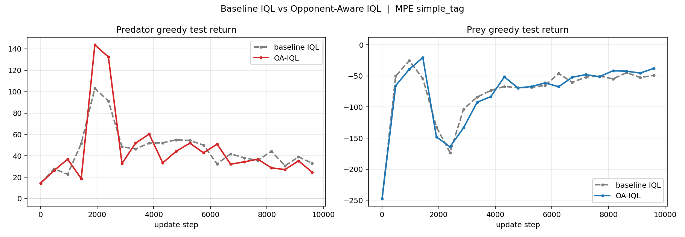
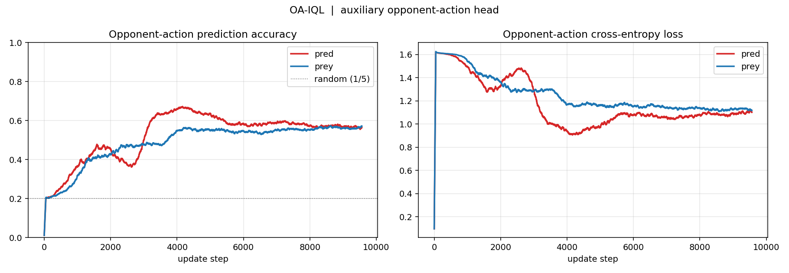
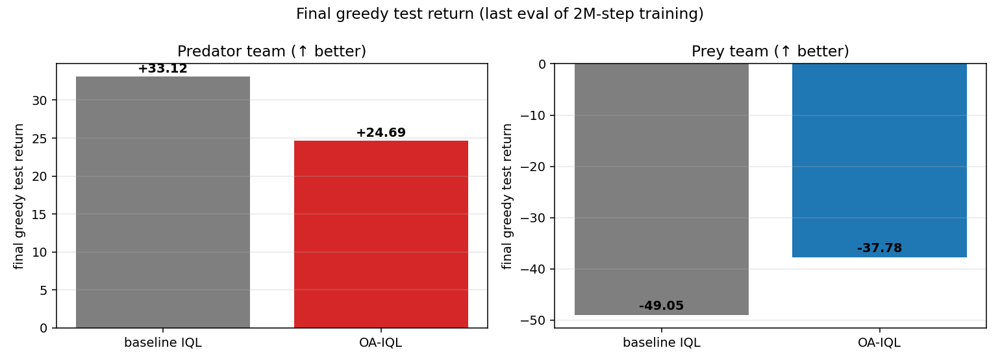

# pp_cotrain — Predator-Prey co-training, with and without opponent modeling

Two-team independent Q-learning on MPE `simple_tag_v3` (3 predators vs 1 prey), and an A/B against an **opponent-aware** variant (OA-IQL) that adds an auxiliary opponent-action prediction head.

---


**OA-IQL does not uniformly beat baseline IQL. It shifts the equilibrium toward prey.**

| metric | baseline | OA-IQL | Δ |
|---|---|---|---|
| final pred greedy return (30-step ep) | **+33.12** | **+24.69** | **−8.44** |
| final prey greedy return (30-step ep) | **−49.05** | **−37.78** | **+11.27** |
| pred peak return (training) | ~+103 @ update 2000 | **~+144 @ update 2000** | +41 |
| opp-action accuracy asymptote | — | ~0.57 (both teams) | — |
| wall-clock per run | 150 s | 158 s | +5 % |

Early training, OA pred *peaks* higher (better early sample efficiency). Later, prey closes the gap faster because its aux task — predicting 3 predators × 5 actions — is richer than pred's task of predicting 1 prey × 5 actions. In a zero-sum-ish game, whoever's opponent model is more informative pulls the equilibrium toward themselves.

---

## What's in the repo

```
src/
  iql_teams.py            # baseline two-team IQL
  iql_teams_oa.py         # opponent-aware IQL (aux opp-action head)
  compare_plots.py        # A/B plots from two metrics npz files
  plot_metrics.py         # per-run training curves + loss/Q plots
  visualize_rollout.py    # greedy rollout GIF from baseline params
  visualize_rollout_oa.py # greedy rollout GIF from OA params

configs/
  config.yaml                       # top-level hydra config
  alg/
    ql_teams_simple_tag.yaml        # baseline hyperparams
    ql_teams_oa_simple_tag.yaml     # OA-IQL hyperparams (adds OPP_AUX_COEF)

docs/
  01_guide.md       # technical walkthrough
  02_demo.md        # 10-minute talk script
  03_qa.md          # anticipated Q&A
  04_quiz.md        # self-check quiz
  05_cheatsheet.md  # numbers + glossary + code-ref table

plots/
  compare_test_returns.png    # A/B, main headline plot
  compare_opp_modeling.png    # OA aux-head accuracy + CE
  compare_summary.png         # final-return bars
  train_curves.png            # baseline per-run curves
  loss_q.png                  # baseline TD loss + mean Q
  rollout.gif                 # baseline seed-7 greedy (5 captures / 60 steps)
  rollout_oa.gif              # OA-IQL  seed-7 greedy (2 captures / 60 steps)

logs/
  MPE_simple_tag_v3/
    iql_teams_*              # baseline params + metrics
    iql_teams_oa_*           # OA-IQL  params + metrics
```

---

## Quickstart

```bash
# 1. env
conda create -n pp_cotrain python=3.11 -y
conda activate pp_cotrain
pip install -e JaxMARL/
pip install "flax==0.10.2"         # JaxMARL pins jax<=0.4.38; default flax breaks
pip install hydra-core flashbax wandb matplotlib

# 2. train both variants (~5 min total on M4 Pro CPU)
python src/iql_teams.py
python src/iql_teams_oa.py alg=ql_teams_oa_simple_tag

# 3. compare
python src/compare_plots.py \
  --baseline logs/MPE_simple_tag_v3/iql_teams_MPE_simple_tag_v3_seed0_metrics.npz \
  --oa       logs/MPE_simple_tag_v3/iql_teams_oa_MPE_simple_tag_v3_seed0_metrics.npz

# 4. rollout GIFs
python src/visualize_rollout.py \
  --pred_params logs/MPE_simple_tag_v3/iql_teams_MPE_simple_tag_v3_pred_seed0_vmap0.safetensors \
  --prey_params logs/MPE_simple_tag_v3/iql_teams_MPE_simple_tag_v3_prey_seed0_vmap0.safetensors \
  --seed 7 --steps 60 --out plots/rollout.gif

python src/visualize_rollout_oa.py \
  --pred_params logs/MPE_simple_tag_v3/iql_teams_oa_MPE_simple_tag_v3_pred_seed0_vmap0.safetensors \
  --prey_params logs/MPE_simple_tag_v3/iql_teams_oa_MPE_simple_tag_v3_prey_seed0_vmap0.safetensors \
  --seed 7 --steps 60 --out plots/rollout_oa.gif
```

---

## How OA-IQL works — one picture

```
             obs ──► Dense(64) ──► ReLU ──► GRU(64) ──┬──► Dense(action_dim) ──► Q-values (the policy)
                                                      │
                                                      └──► Dense(opp_n × action_dim) ──► opp-action logits
                                                            │
                                                            └─ CE vs opp actions in replay buffer
                                                                (shapes the trunk; discarded at eval)
```

Loss per team:

```
L = L_Q  +  OPP_AUX_COEF · CE(opp_action_pred, opp_action_true)
```

`OPP_AUX_COEF = 0.5` in the config. The Bellman target, target-network update, optimizer, replay buffer, and eval loop are **identical** to the baseline. Only the net has a second head and the loss has a second term.

---

## The three-phase A/B story



1. **Updates 0–2000 — co-adaptation starts.** Both variants track each other. Prey return climbs from −247 to ~−50 (boundary-penalty learning). Pred return climbs from +15 to ~+50.
2. **Updates ~2000 — peak divergence.** OA-IQL predator peaks at **+144**; baseline peaks at +103. The opp-aware trunk gives pred faster credit assignment early, because the opp-CE provides a dense, stable gradient on top of sparse Bellman backups.
3. **Updates 4000–9615 — equilibrium shift.** Prey also benefits from OA (its aux task is richer) and catches up faster. By the end, **OA-prey +11 above baseline-prey, OA-pred −8 below baseline-pred.**



Co-training is zero-sum-like: a method that helps both sides can still hurt one side if it helps the other more.

---

## What's honest to say about this

- OA-IQL is a **representation-learning auxiliary**, not a planner. No tree search, no MCTS, no Bayesian posterior — just DRON-style opponent-action prediction at 0.5× weight.
- The opponent head is **training-time only**. Inference cost and policy-network size at test time are identical to baseline.
- Single seed per variant. Multi-seed is a flag (`NUM_SEEDS: 5` via `jax.vmap`); budget ~12 min.
- `OPP_AUX_COEF = 0.5` is a reasonable default from auxiliary-loss literature, not tuned.
- Results are nuanced, not a uniform win. That's the interesting part.

---

## What's next (plumbing, not research)

- **Asymmetric aux weights.** `OPP_AUX_COEF_PRED = 0.5, OPP_AUX_COEF_PREY = 0.0` should give pred the benefit without prey's offsetting gain. One flag change.
- **Aux-weight sweep.** {0.1, 0.25, 0.5, 1.0, 2.0}. ~12 min total.
- **Opponent head as 1-step planner.** At action-selection, sample k opp-actions from the head, evaluate Q under each, pick action with best robust-min or expectation. Zero extra training cost.
- **Swap aux task to opponent-reward prediction.** More policy-invariant (approaches BIRL). Harder supervised signal, more stable across the non-stationarity.

---

## Deeper docs

- [`docs/01_guide.md`](docs/01_guide.md) — technical walkthrough, line references, the dtype bug
- [`docs/02_demo.md`](docs/02_demo.md) — 10-min talk script with exact slides and pull-ups
- [`docs/03_qa.md`](docs/03_qa.md) — 17 anticipated questions with short+detail answers
- [`docs/04_quiz.md`](docs/04_quiz.md) — self-check quiz, 6 sections, answers at bottom
- [`docs/05_cheatsheet.md`](docs/05_cheatsheet.md) — numbers, glossary, code-ref table
